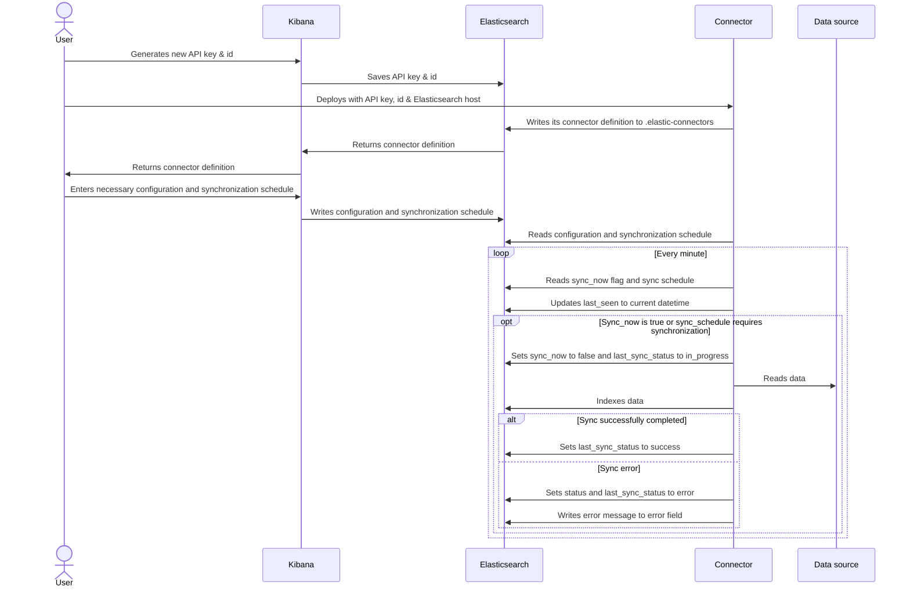

# Connector Protocol
**Version 1, Jul 25 2022**

To enable Elasticsearch users to ingest any kind of data and build a search experience on top of that data, we are providing a lightweight protocol that will allow users to easily ingest data, use Enterprise Search features to manipulate that data and create a search experience, while providing them with a seamless user experience in Kibana. To be compatible with Enterprise Search and take full advantage of the connector features available in Kibana, a connector should adhere to the protocol defined here.

## Main tenets

### Architecture
- All communication between connectors and other parts of the system happen asynchronously through an Elasticsearch index
- We want to minimize the number of indices we use to manage the system. Elasticsearch is not a relational database but a document store, and we want to optimize for that architecture.
- Users must be able to easily manage their search-related indices and connectors in Kibana
- The system must be robust and able to deal with unexpected downtime and crashes.

### Connectors

Connectors can:
- Ship large amounts of data to an Elasticsearch index independently.
- communicate their status to Elasticsearch and Kibana so that users can provide it with configuration and diagnose any issues.
- Handle early termination and crashes well .

At this stage, our assumption is that one connector will manage one index, and one index will have only one connector associated with it. This may change in the future.

## Communication protocol

All communication will need to go through Elasticsearch. We've created an index called `.elastic-connectors`, where each connector will have one entry. In addition, there's a synchronization jobs log index called `.elastic-connectors-sync-jobs`. You can find the definitions for these indices further below in this section.

### Protocol flow and responsibilities

To connect to Elasticsearch, a connector will need an Elasticsearch API key that grants read and write access to `.elastic-connectors` and `.elastic-connectors-sync-jobs` as well as `manage`, `read` and `write` to the index it will write documents to. In addition, the connector will need the document ID for their entry in the `.elastic-connectors` index. Users will need to manually configure that API key and the document ID in their deployment.

Once configured, the connector will be able to connect and read the specified configuration in the `.elastic-connectors` index, and write its own configuration schema and status to that document. The user will then be able to use Kibana to update that configuration with the appropriate values, as well as enable and change a sync schedule or request an immediate sync.

**Connector responsibilies**

Connectors should update the last_seen field with their current datetime in UTC format (timezone-agnostic) every half hour, and every time they perform a sync job, so we can signal to the user when a connector is likely to be offline.

- Read the configuration from the relevant document in `.elastic-connectors`, including the index name to be indexed to
- Write its configuration schema to the document if not already present
- Set the index mappings of the to-be-written-to index if not already present
- Regularly write its status to the document
- Read the sync schedule from the document and synchronize with the data source accordingly
- Sync with the data source and index resulting documents into the correct index
- Log sync jobs to `.elastic-connectors-sync-jobs`
- Write a UTC date-time to the `last_seen` property as a heartbeat, at least every half hour. Kibana will show an error if the date in `last_seen` is more than half an hour ago.

**Sequence diagram**:

### .elastic-connectors

This is our main communication index, used to communicate the connector's configuration, status and other related data. All dates in UTC.
```
{
  api_key_id: string;   -> ID of the current API key in use
  configuration: {
    [key]: {
      label: string
      value: string,
    }
  };                    -> Definition and values of configurable
                           fields
  error: string;        -> Optional error message
  index_name: string;   -> The index data will be written to
  language: string;     -> the language used for the analyzer
  last_seen: date;      -> Connector writes check-in date-time
                           regularly (UTC)
  last_sync_error: string;   -> Optional last sync error message
  last_sync_status: string;  -> last sync Enum, see below
  last_synced: date;    -> Date/time of last completed sync (UTC)
  last_indexed_document_count: number;    -> How many documents were inserted into the index
  last_deleted_document_count: number;    -> How many documents were deleted from the index
  name: string; -> the name to use for the connector
  pipeline: {
    extract_binary_content: boolean; -> Whether or not the `request_pipeline` should handle binary data
    name: string; ->  Ingest pipeline to utilize on indexing data to Elasticsearch
    reduce_whitespace: boolean; -> Whether or not the `request_pipeline` should squish redundant whitespace
    run_ml_inference: boolean; -> Whether or not the `request_pipeline` should run the ML Inference pipeline
  }
  scheduling: {
    enabled: boolean; -> Is sync schedule enabled?
    interval: string; -> Quartz Cron syntax
  };
  service_type: string; -> Optional, used for UI sugar
  status: string;       -> Enum, see below
  sync_now: boolean; -> Flag to signal user wants to initiate a sync
}
```
**Possible values for 'status'**
- `created` -> entry has been created but connector has not connected to elasticsearch (written by index creator)
- `needs_configuration` -> connector has written its configuration to elasticsearch (written by connector)
- `configured` -> connector has been fully configured (written by kibana on updating configuration, or directly by connector if no further configuration is necessary)
- `connected` -> connector has successfully connected to the data source (written by connector on successfully connecting to data source )
- `error` -> connector has encountered an error that needs recovery (written by connector on encountering any error)

**last_sync_status enum**
- `null` -> no sync has ever started
- `in_progress` -> sync successfully started
- `completed` -> sync successfully completed
- `error` -> sync error

### Elasticsearch mappings for .elastic-connectors:
```
"mappings" : {
  "properties" : {
    "api_key_id" : { "type" : "keyword" },
    "configuration" : { "type" : "object" },
    "error" : { "type" : "text" },
    "index_name" : { "type" : "keyword" },
    "language" : { "type" : "keyword" },
    "last_seen" : { "type" : "date" },
    "last_sync_error" : { "type" : "text" },
    "last_sync_status" : { "type" : "keyword" },
    "last_synced" : { "type" : "date" },
    "last_indexed_document_count" : { "type" : "integer" },
    "last_deleted_document_count" : { "type" : "integer" },
    "name" : { "type" : "keyword" },
    "pipeline" : {
      "properties" : {
        "extract_binary_content": { "type" : "boolean" },
        "name" : { "type" : "keyword" },
        "reduce_whitespace" : { "type" : "boolean" },
        "run_ml_inference" : { "type" : "boolean" },
      }
    }
    "scheduling" : {
      "properties" : {
        "enabled" : { "type" : "boolean" },
        "interval" : { "type" : "text" }
      }
    },
    "service_type" : { "type" : "keyword" },
    "status" : { "type" : "keyword" },
    "sync_now" : { "type" : "boolean" },
  }
}
```

### Jobs index
In addition to the .elastic-connectors index for documents, we have an index to log all jobs run by connectors. This is the .elastic-connectors-sync-jobs index. Each JSON document will have the following structure:
```
{
  connector: object; -> Copy of the current connector document
  connector_id: string; -> id of the connector document in .elastic-connectors
  status: string; -> Same enum as sync_status above
  error: string;
  Worker_hostname: string;
  deleted_document_count: number;
  indexed_document_count: number;
  index_name: string;
  created_at: date;
  updated_at: date;
}
```
### Elasticsearch mappings for .elastic-connectors-sync-jobs:
```
"mappings" " {
  "properties" : {
    "connector_id" : { "type" : "keyword" },
    "status" : { "type" : "keyword" },
    "error" : { "type" : "text" },
    "worker_hostname" : { "type" : "keyword" },
    "indexed_document_count" : { "type" : "integer" },
    "deleted_document_count" : { "type" : "integer" },
    "index_name": { "type": "keyword" },
    "created_at" : { "type" : "date" },
    "completed_at" : { "type" : "date" }
  }
}
```

### Migration concerns
If the mapping of `.elastic-connectors` or `.elastic-connectors-sync-jobs` is updated in a future version in a way that necessitates a complete re-indexing, Kibana will migrate that data if a user with sufficient permissions is logged in.

To facilitate migrations we'll use aliases for the .elastic-connectors and .elastic-connectors-sync-jobs indices, and update the underlying index the alias points to when we need to migrate data to a new mapping. The name of those indices will be the same as the alias, with a version appended. So right now, those indices are:
`.elastic-connectors-v1`
`.elastic-connectors-sync-jobs-v1`

In addition to the name of the index, we'll store a version number in each index's metadata to check against and make sure we're operating on the correct version of each index, and migrate the data otherwise.
