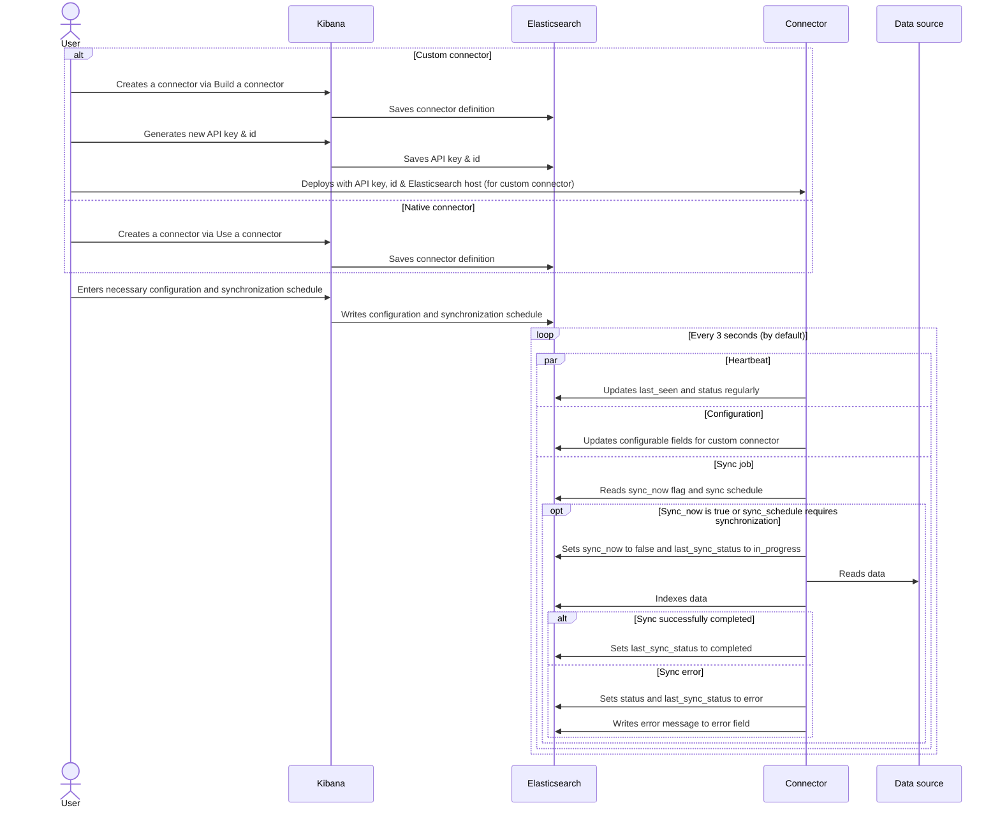

# Connector Protocol

To enable Elasticsearch users to ingest any kind of data and build a search experience on top of that data, we are providing a lightweight protocol that will allow users to easily ingest data, use Enterprise Search features to manipulate that data and create a search experience, while providing them with a seamless user experience in Kibana. To be compatible with Enterprise Search and take full advantage of the connector features available in Kibana, a connector should adhere to the protocol defined here.

## Main tenets

### Architecture
- All communication between connectors and other parts of the system happen asynchronously through an Elasticsearch index
- We want to minimize the number of indices we use to manage the system. Elasticsearch is not a relational database but a document store, and we want to optimize for that architecture.
- Users must be able to easily manage their search-related indices and connectors in Kibana
- The system must be robust and able to deal with unexpected downtime and crashes.

### Connectors

Connectors can:
- Ship large amounts of data to an Elasticsearch index independently.
- communicate their status to Elasticsearch and Kibana so that users can provide it with configuration and diagnose any issues.
- Handle early termination and crashes well .

At this stage, our assumption is that one connector will manage one index, and one index will have only one connector associated with it. This may change in the future.

## Communication protocol

All communication will need to go through Elasticsearch. We've created a connector index called `.elastic-connectors`, where a document represents a connector. In addition, there's a connector job index called `.elastic-connectors-sync-jobs`, which holds the sync job history. You can find the definitions for these indices in the next section.

### Index definition

#### Connector index `.elastic-connectors`

This is our main communication index, used to communicate the connector's configuration, status and other related data. All dates in UTC.
```
{
  configuration: {
    [key]: {
      label: string     -> The label to be displayed for the field in Kibana
      value: string,    -> The value of the field configured in Kibana
    }
  };                    -> Definition and values of configurable
                           fields
  description: string;  -> the description of the connector
  error: string;        -> Optional error message
  index_name: string;   -> The name of the content index where data will be written to
  is_native: boolean;   -> Whether this is a native connector
  language: string;     -> the language used for the analyzer
  last_seen: date;      -> Connector writes check-in date-time
                           regularly (UTC)
  last_sync_error: string;   -> Optional last sync error message
  last_sync_status: string;  -> last sync status Enum, see below
  last_synced: date;    -> Date/time of last sync (UTC)
  last_indexed_document_count: number;    -> How many documents were indexed in the last sync
  last_deleted_document_count: number;    -> How many documents were deleted in the last sync
  name: string; -> the name to use for the connector
  pipeline: {
    extract_binary_content: boolean; -> Whether the `request_pipeline` should handle binary data
    name: string; ->  Ingest pipeline to utilize on indexing data to Elasticsearch
    reduce_whitespace: boolean; -> Whether the `request_pipeline` should squish redundant whitespace
    run_ml_inference: boolean; -> Whether the `request_pipeline` should run the ML Inference pipeline
  }
  scheduling: {
    enabled: boolean; -> Whether sync schedule is enabled
    interval: string; -> Quartz Cron syntax
  };
  service_type: string; -> Service type of the connector
  status: string;       -> Connector status Enum, see below
  sync_now: boolean;    -> Flag to signal user wants to initiate a sync
}
```
**Possible values for 'status'**
- `created` -> A document for a connector has been created in connector index but the connector has not connected to elasticsearch (written by index creator).
- `needs_configuration` -> Configurable fields have been written into the connector, either by Kibana (for native connector) or connector (for custom connector.
- `configured` -> A connector has been fully configured (written by Kibana on updating configuration, or directly by connector if no further configuration is necessary).
- `connected` -> A connector has successfully connected to the data source (written by connector on successfully connecting to data source).
- `error` -> A connector has encountered an error, either because the data source is not healthy or the last sync failed.

**last_sync_status enum**
- `null` -> No sync job has ever started.
- `in_progress` -> A sync job successfully started.
- `completed` -> A sync job successfully completed.
- `failed` -> A sync job failed.

#### Elasticsearch mappings for `.elastic-connectors`:
```
"mappings" : {
  "properties" : {
    "configuration" : { "type" : "object" },
    "description" : { "type" : "text" },
    "error" : { "type" : "text" },
    "index_name" : { "type" : "keyword" },
    "is_native" : { "type" : "boolean" },
    "language" : { "type" : "keyword" },
    "last_seen" : { "type" : "date" },
    "last_sync_error" : { "type" : "text" },
    "last_sync_status" : { "type" : "keyword" },
    "last_synced" : { "type" : "date" },
    "last_indexed_document_count" : { "type" : "integer" },
    "last_deleted_document_count" : { "type" : "integer" },
    "name" : { "type" : "keyword" },
    "pipeline" : {
      "properties" : {
        "extract_binary_content": { "type" : "boolean" },
        "name" : { "type" : "keyword" },
        "reduce_whitespace" : { "type" : "boolean" },
        "run_ml_inference" : { "type" : "boolean" },
      }
    }
    "scheduling" : {
      "properties" : {
        "enabled" : { "type" : "boolean" },
        "interval" : { "type" : "text" }
      }
    },
    "service_type" : { "type" : "keyword" },
    "status" : { "type" : "keyword" },
    "sync_now" : { "type" : "boolean" },
  }
}
```

#### Connector job index `.elastic-connectors-sync-jobs`
In addition to the connector index `.elastic-connectors`, we have an additional index to log all jobs run by connectors. This is the `.elastic-connectors-sync-jobs` index. Each JSON document will have the following structure:
```
{
  connector_id: string; -> ID of the connector document in .elastic-connectors
  status: string; -> Same enum as sync_status above
  error: string; -> Optional error message
  worker_hostname: string; -> The hostname of the worker to run the sync job
  indexed_document_count: number; -> Number of documents indexed in the sync job
  deleted_document_count: number; -> Number of documents deleted in the sync job
  created_at: date; -> The date/time when the sync job is created
  completed_at: date; -> The data/time when the sync job is completed
}
```
#### Elasticsearch mappings for `.elastic-connectors-sync-jobs`:
```
"mappings" " {
  "properties" : {
    "connector_id" : { "type" : "keyword" },
    "status" : { "type" : "keyword" },
    "error" : { "type" : "text" },
    "worker_hostname" : { "type" : "keyword" },
    "indexed_document_count" : { "type" : "integer" },
    "deleted_document_count" : { "type" : "integer" },
    "created_at" : { "type" : "date" },
    "completed_at" : { "type" : "date" }
  }
}
```

### Protocol flow and responsibilities

To connect a custom connector to Elasticsearch, it requires an Elasticsearch API key that grants read and write access to `.elastic-connectors` and `.elastic-connectors-sync-jobs` as well as `manage`, `read` and `write` to the index it will write documents to. In addition, the connector will need the document ID for their entry in the `.elastic-connectors` index. Users will need to manually configure that API key and the document ID in their deployment.

Once configured, the connector will be able to connect and read the specified configuration in the `.elastic-connectors` index, and write its own configuration schema and status to that document. The user will then be able to use Kibana to update that configuration with the appropriate values, as well as enable and change a sync schedule or request an immediate sync.

**Connector responsibilities**

For every half hour, and every time a sync job is executed, the connector should update the following fields so we can signal to the user when a connector is likely to be offline:
- the `last_seen` field with their current datetime in UTC format (timezone-agnostic).
- the `status` field to either `connected` or `error`, indicating the health status of the remote data source.
- the `error` field, when the remote data source is not healthy.

For custom connectors, the connector should also update `configuration` field if its status is `created`.

The connector should also sync data for connectors:
- Read connector definitions from `.elastic-connectors` regularly, and determine whether to sync data based on `sync_now` flag and `scheduling`. 
- Set the index mappings of the to-be-written-to index if not already present.
- Sync with the data source and index resulting documents into the correct index.
- Log sync jobs to `.elastic-connectors-sync-jobs`.

**Sequence diagram**:



### Migration concerns
If the mapping of `.elastic-connectors` or `.elastic-connectors-sync-jobs` is updated in a future version in a way that necessitates a complete re-indexing, Kibana will migrate that data if a user with sufficient permissions is logged in.

To facilitate migrations we'll use aliases for the `.elastic-connectors` and `.elastic-connectors-sync-jobs` indices, and update the underlying index the alias points to when we need to migrate data to a new mapping. The name of those indices will be the same as the alias, with a version appended. So right now, those indices are:
`.elastic-connectors-v1`
`.elastic-connectors-sync-jobs-v1`

In addition to the name of the index, we'll store a version number in each index's metadata to check against and make sure we're operating on the correct version of each index, and migrate the data otherwise.
